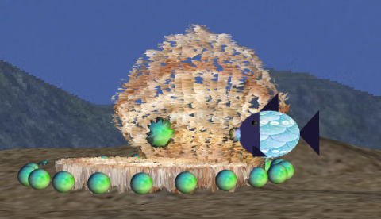

# CGRA 2020/2021

## Group T03G01
| Name                     | Number    | E-Mail              |
| ------------------------ | --------- | ------------------- |
| Margarida Raposo         | 201906784 | up201906784@fe.up.pt|
| Miguel Amorim            | 201907756 | up201907756@fe.up.pt|

----

## Implemented Functionalities

All the functionalities described below were implemented successfully.

### Basic Functionalities
4. MyFish
5. Scene Elements Modeling
6. Additional controls and animations

### Aditional Functionalities
7.1. Seaweeds  
7.2. Animated Seaweeds  
7.5. MyAnimatedFish  

## Screenshots
1. Fish  

   
2. SeaFloor and Nest

3. Surface

4. Rock and RockSet

5. Pillars

6. Overview  

   
7. Dropping a Rock on the Nest

